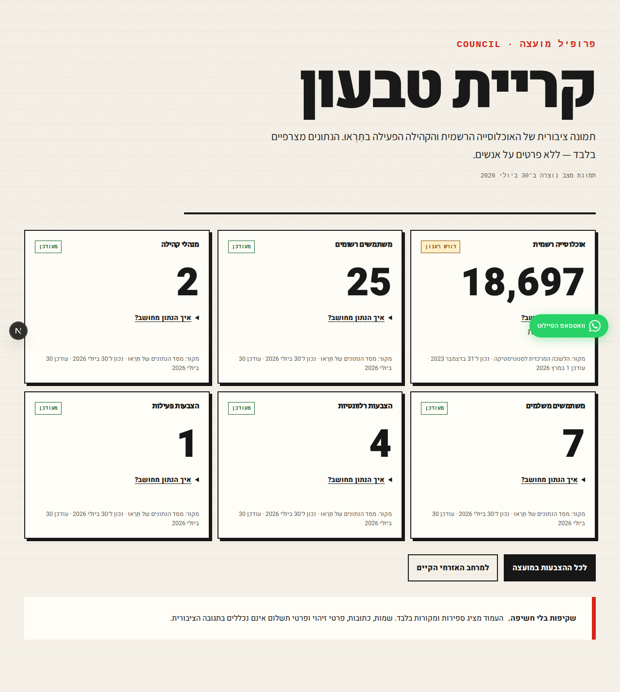

# Issue #65 — public council profiles

Independent verification exercised the aggregate boundary, SQL migration/RPC,
feature rollback, API privacy contract, and the rendered Hebrew RTL states.

## Acceptance results

1. **Pass — canonical identity and legacy route.** The SQL fixture resolved the
   Hebrew slug, spelling alias, and stable UUID to the same council UUID and
   canonical slug. The production build includes both
   `/[locale]/councils/[identifier]` and the existing
   `/[locale]/municipality/[slug]`.
2. **Pass — independent sources.** Official population is stored with a CBS
   source URL/as-of/update timestamp, independently from registered Taruu user
   assignments. The Kiryat Tivon seed and SQL result reconcile to **18,697**.
3. **Pass — aggregation rules.** A PostgreSQL-compatible PGlite execution of the
   actual migration used repository-accurate enums and schema. Its fixture
   returned 4 assigned users, 2 currently active managers (excluding expired
   and future assignments), and 2 distinct qualifying payers (excluding
   refunded, pending, and another-council payments).
4. **Pass — public API contract/privacy.** Focused API tests cover unknown
   councils, zero values, unavailable source data, fail-closed errors, feature
   rollback, and forbidden identity/address/payment/provider keys.
5. **Pass — RTL UI states.** Playwright verified desktop populated/stale and
   keyboard-focusable metric explanations, mobile empty/no-overflow, missing
   source, and API error states, together with vote/civic-space links.
6. **Pass — rollback.** `COUNCIL_PUBLIC_PAGES_ENABLED=false` produces a 404 for
   the new API/page paths without removing the legacy municipality route.
7. **Pass — automated coverage.** Domain, API/privacy, SQL aggregation, and
   browser-state checks all passed.

## SQL/RPC reconciliation

The verifier installed `@electric-sql/pglite@0.3.14` in an isolated `/tmp`
prefix, defined the repository's actual `payment_status`, `payment_type`, and
`vote_status` enums plus the referenced table shapes, applied
`supabase/migrations/20260730000001_public_council_profiles.sql` unchanged, and
loaded boundary fixtures.

Command:

```text
cd /tmp/issue-65-sql && node verify.mjs
```

Outcome: migration applied; slug/alias/UUID all returned one council; population
18,697; registered users 4; active managers 2; distinct payers 2; relevant votes
3; active votes 1; and the second council returned null official source fields
with an explicit registered-user count.

## Validation commands

```text
pnpm --filter @sync/web exec vitest run src/server/domain/council/public-profile.test.ts src/__tests__/api/councils.test.ts
# 2 files, 12 tests passed

NEXT_PUBLIC_SUPABASE_URL=http://127.0.0.1:54321 \
NEXT_PUBLIC_SUPABASE_ANON_KEY=test SUPABASE_SERVICE_ROLE_KEY=test \
pnpm --filter @sync/web exec playwright test tests/e2e/council-public-page.spec.ts
# 3 passed

pnpm test
# 7 workspace tasks passed; web 59 files / 691 tests, shared 130 tests,
# api-client 125 tests, and mobile tests passed

pnpm typecheck
# 8 tasks passed

pnpm lint
# passed with 2 pre-existing warnings, 0 errors

NEXT_PUBLIC_SUPABASE_URL=http://127.0.0.1:54321 \
NEXT_PUBLIC_SUPABASE_ANON_KEY=test pnpm build
# 4 tasks passed; Next.js production build generated both council routes

node scripts/agentic/check-evidence.mjs
# run after this report was assembled
```

The first concurrent typecheck attempt raced the Next build's `.next/types`
generation and reported transient missing generated files. Re-running
`pnpm typecheck` after the build completed passed cleanly.

## Visual evidence

### Desktop populated/stale with explanation control



### Mobile empty state


### Missing official source / unavailable state


The browser uses a mocked aggregate API payload through the existing Playwright
route fixture; all screenshots are the real application UI.

## Residual risk

The migration was executed in PostgreSQL-compatible PGlite rather than the
repository's Dockerized Supabase stack because Docker access and the Supabase
CLI were unavailable on the verifier VM. Supabase-specific role grants were
parsed and applied, and all SQL objects, enums, joins, time windows, refunds,
distinct counts, aliases, and result columns were exercised. A final staging
migration smoke test remains prudent before release.
